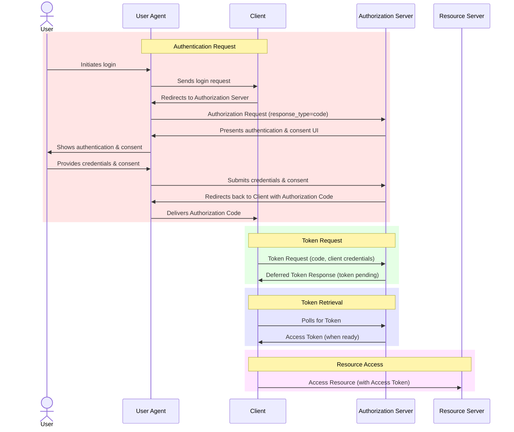

# Deferred Token Response for OAuth Authorization - Proposition Resources

This repository holds the resources for the proposition of an extension to the OpenID Connect protocol that we've been naming as *Deferred Token Response*

You can access the latest automatic build from main branch here: https://gniero.github.io/oidc-dtr-resources/

## What is this?
The Deferred Token Response protocol makes it possible for an Authorization Server (OpenID Provider) to defer the issuance of a token until a later time when responding to an Authorization Request.
This is useful in cases where Authenticating the End-User takes a very long time.

This is useful in common use cases based on electronic identification of natural persons:
- Electronic signatures
- High-risk transaction approval
- Claim verification (age verification, address verification, etc.)
- Account reactivation

For cases where immediate End-User Authentication is available, OpenID Connect Core is the prevailing standard today.
But since OpenID Connect Core relies on redirect-based flows, it cannot be used for cases where End-User Authentication takes a very long time.

Here is an overview of the proposed flow:


## Why not just use CIBA?
The Client-Initiated Backchannel Authentication Flow (CIBA) is an extension to OpenID Connect Core which also allows the Authorization Server to defer the issuance of an ID Token.
The deferred issuance is possible because CIBA introduces an asynchronous method of delivering the Authorization Result (i.e. ID Token).

To support the CIBA flow, the Authorization Server (OpenID Provider) must have some mechanism of initiating user authentication out-of-band from the interaction with the consumption device.
This limits the applicability of the CIBA flow in comparison to the usual OpenID Connect Core flows.
In particular, CIBA can only be used when the End-User is pre-registered with the OpenID Provider.

A very common use case for OpenID Connect Core is in electronic identification of natural persons (End-Users).
In this context, some OpenID Providers are able to authenticate *any* natural person (End-User) based on e.g. a government-issued identification document.
Since the End-User is not previously known to the OpenID Provider, there is no mechanism of initiating user authentication out-of-band from the interaction with the consumption device.

### Similarity to a just-in-time out-of-band mechanism
A CIBA flow can be supported by any OpenID Provider by first establishing a mechanism of initiating user authentication out-of-band from the interaction with the consumption device.

There are two cases to consider:
1. The End-User is accessing the Relying Party using the device used for Authentication.
2. The End-User is accessing the Relying Party using a different device than the one used for Authentication.

One undesirable option is to send the End-User an email or SMS containing a link to the authentication service.
This would train End-Users to click links in a high-security context, which is extremely undesirable.

## Rendering the draft document
The draft is written in the  `mmark` Markdown dialect and is stored in `openid-deferred-token-response-1_0.md`.

To render the draft to an HTML or text file, you will need
- [The `mmark` tool](https://github.com/mmarkdown/mmark)
- [The `xml2rfc` tool](https://github.com/ietf-tools/xml2rfc)

You can convert the Markdown file to XML by running:
```shell
mmark openid-deferred-token-response-1_0.md > openid-deferred-token-response-1_0.xml
```

You can then convert the XML file to HTML and text by running:
```shell
xml2rfc openid-deferred-token-response-1_0.xml --text --html --v3
```
